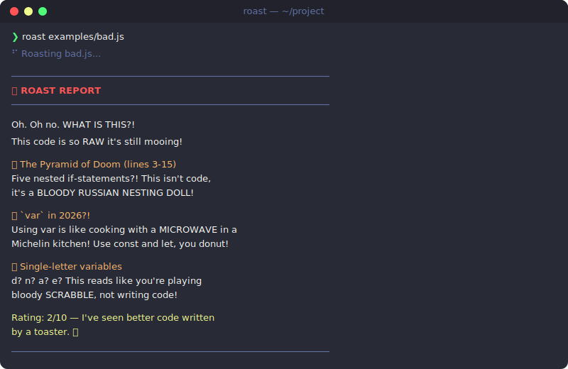

<div align="center">

# 🔥 roast

**Gordon Ramsay meets your IDE.**

Brutally honest, hilariously harsh AI code reviews — from your terminal.

[](https://www.npmjs.com/package/roast-cli)
[](./LICENSE)
[](https://nodejs.org)

<br/>



<br/>

*Your linter tells you what's wrong. Roast tells you why you should be ashamed.*

</div>

---

## The Problem

Code review tools are **boring**. ESLint tells you to add a semicolon. TypeScript yells about types. SonarQube generates a 47-page PDF nobody reads.

Meanwhile, your actual code problems — pyramid of doom, god functions, cargo-cult patterns — slide right through.

**You don't need another linter. You need someone who cares enough to be mean about it.**

## The Solution

`roast` sends your code to an AI with the personality of a furious celebrity chef. You get back:

- 🔪 **Savage but accurate** feedback on real code smells
- 🎭 **Three intensity levels** — from gentle nudge to Gordon Ramsay meltdown  
- 📝 **Actionable fixes** hidden inside every insult
- 🌍 **Any language** — JS, Python, Go, Rust, Java, you name it

## Quick Start

```bash
# Install
npm install -g roast-cli

# Set your OpenAI key
export OPENAI_API_KEY=sk-...

# Roast a file
roast app.js
```

That's it. Three commands. Now go fix your code.

## Usage

```bash
# Roast a file (default: brutal mode)
roast server.js

# Be gentle about it
roast --level mild utils.py

# Medium spice
roast --level medium handler.go

# Roast your staged git changes
git diff --staged | roast --diff

# Pipe from anywhere
cat spaghetti.rb | roast

# JSON output for CI integration
roast --json src/index.ts

# Use a specific model
roast --model gpt-4o legacy-code.java
```

## Roast Levels

| Level | Vibe | Best For |
|-------|------|----------|
| `--level mild` | Friendly mentor | New devs, PRs you want to keep diplomatic |
| `--level medium` | Sarcastic senior dev | Team code reviews, your own code |
| `--level brutal` | Gordon Ramsay 🔥 | Entertainment, humbling yourself, Fridays |

## Examples

### JavaScript — The Pyramid of Doom

```bash
$ roast examples/bad.js
```

```
──────────────────────────────────────────────────────────
  🔥 ROAST REPORT
──────────────────────────────────────────────────────────

Oh. Oh no. WHAT IS THIS?!

This code is so RAW it's still mooing!

🔪 The Pyramid of Doom (lines 3-15)
Five nested if-statements?! This isn't code, it's a
BLOODY RUSSIAN NESTING DOLL! Ever heard of early returns?

🔪 `var` in 2026?!
Using var is like cooking with a MICROWAVE in a Michelin
kitchen! Use const and let, you donut!

🔪 Single-letter variables
d? n? a? e? This reads like you're playing bloody
SCRABBLE, not writing code!

Rating: 2/10 — I've seen better code written by a toaster. 🔥
```

### Python — The God Function

```bash
$ roast --level medium examples/bad.py
```

```
──────────────────────────────────────────────────────────
  🔥 ROAST REPORT
──────────────────────────────────────────────────────────

Oh, a function with 9 parameters and a bare except:pass.
You must be fun at incident postmortems.

🔍 calc(x, y, z, a, b, c, d, e, f)
Nine. Parameters. Did you lose a bet, or do you genuinely
hate everyone who'll maintain this? Use **kwargs or a
dataclass. Please. I'm begging.

🔍 except: pass
Congratulations, you've invented a black hole for bugs.
Nothing escapes. Not even your dignity.

🔍 The process() method
All three branches do the exact same thing. That's not
a switch statement, that's a cry for help:
  return [x for x in input if x['type'] in {'A','B','C'}]

There. One line. You're welcome.
```

### Go — The `interface{}` Wasteland

```bash
$ roast examples/bad.go
```

```
──────────────────────────────────────────────────────────
  🔥 ROAST REPORT
──────────────────────────────────────────────────────────

What in the BLOODY HELL is "doStuff"?! That's not a
function name, that's a SURRENDER!

🔪 interface{} everywhere
You've turned a statically typed language into JavaScript.
That takes EFFORT! And not the good kind!

🔪 Type assertions without ok checks
data.(map[string]interface{}) with no comma-ok? That's
a PANIC waiting to happen! This code is a ticking time
bomb served on a silver platter!

🔪 "doEverything()"
A function called doEverything that does NOTHING useful.
At least the name is honest about its AMBITION!

Rating: 3/10 — The error handling saved you from a 1.
Now go learn about generics, they exist for a REASON! 🔥
```

## Before → After

<table>
<tr>
<td width="50%">

**Before: Your linter output** 😴
```
src/app.js
  3:5  warning  Unexpected var  no-var
  5:22 warning  Use === instead  eqeqeq
  12:1 warning  Missing semicol  semi
  
✖ 3 problems (0 errors, 3 warnings)
```

*Technically correct. Emotionally empty.*

</td>
<td width="50%">

**After: `roast src/app.js`** 🔥
```
🔪 Using var in 2026 is like bringing
a flip phone to a tech conference. WHY?!

🔪 == true? If you have to ask a boolean
whether it's true, you have trust issues.

🔪 No semicolons AND no consistency?
Pick a style. ANY style. Please.

Rating: 3/10 — Your code works despite
itself. Barely.
```

*You'll actually remember this feedback.*

</td>
</tr>
</table>

## Configuration

### Environment Variables

| Variable | Required | Default | Description |
|----------|----------|---------|-------------|
| `OPENAI_API_KEY` | ✅ | — | Your OpenAI API key |
| `ROAST_MODEL` | | `gpt-4o-mini` | Default model |
| `ROAST_LEVEL` | | `brutal` | Default roast intensity |

### Supported Models

Any OpenAI-compatible model works:

- `gpt-4o-mini` — Fast & cheap (default)
- `gpt-4o` — Smarter roasts
- `gpt-4-turbo` — Premium burns
- Any OpenAI-compatible API (Ollama, Together, etc.)

## CI Integration

Add roast to your PR pipeline for code review with personality:

```yaml
# .github/workflows/roast.yml
- name: Roast PR changes
  run: |
    git diff origin/main...HEAD -- '*.js' '*.ts' | roast --diff --json
  env:
    OPENAI_API_KEY: ${{ secrets.OPENAI_API_KEY }}
```

## vs Alternatives

| Tool | What it does | Vibe |
|------|-------------|------|
| ESLint | Rule-based linting | 🤖 "Line 12: missing semicolon" |
| SonarQube | Enterprise code quality | 📊 47-page PDF |
| CodeRabbit | AI PR review | 🐰 Polite suggestions |
| **roast** | **AI code roasting** | **🔥 "This code is DISGUSTING!"** |

`roast` isn't a replacement for your linter. It's the brutal honesty your linter is too polite to give you. Use both.

## FAQ

**Q: Does it actually help?**  
A: Yes. Every roast contains real, actionable feedback. The humor makes you actually read it.

**Q: Will it hurt my feelings?**  
A: Use `--level mild` if you're emotionally fragile. No judgment. Actually, a little judgment.

**Q: How much does it cost?**  
A: ~$0.001 per roast with `gpt-4o-mini`. Mass roasting your entire codebase costs less than a coffee.

**Q: Can I use it with Ollama / local models?**  
A: Set `OPENAI_BASE_URL` to your local endpoint. Works with any OpenAI-compatible API.

## Contributing

Found a bug? Want a new roast persona? PRs welcome.

```bash
git clone https://github.com/muin-company/cli-tools.git
cd cli-tools/packages/roast
npm install
node src/cli.js examples/bad.js
```

## License

MIT © [MUIN](https://muin.company)

---

<div align="center">

**Built by [MUIN](https://muin.company)** — *AI가 일하고, 인간이 누린다.*

🔥 Stop writing bad code. Or don't — we'll roast it either way.

</div>
